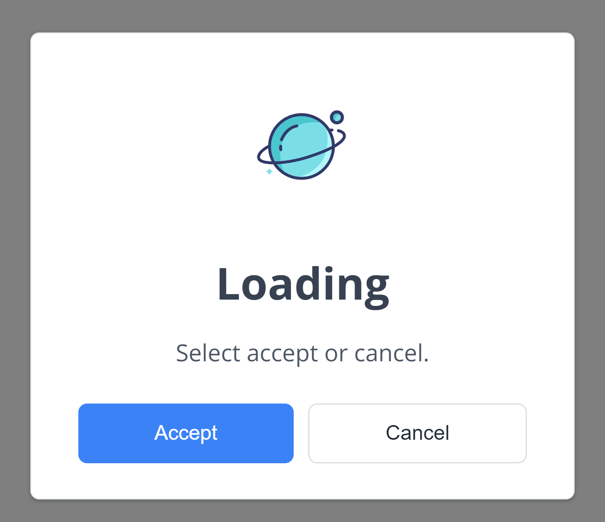

# Woody's alertMe Library

**woody-alert-me** is a lightweight library for creating customizable **alert boxes** with animations.



## Installation

You can install woody-alert-me via **npm**:

```
npm i woody-alert-me
```

## Usage

First, link the **CSS and JavaScript** provided with Woody's AlertMe library:
```
<link rel="stylesheet" href="./path/to/woody-alert-me.css">
```
```
<script src="./path/to/woody-alert-me.js"></script>
```

**Basic Alert** with the desired message:
```
alertMe('Alert', 'This is a basic alert.');
```

**Customized alerts** by passing an options object to the alertMe function:
```
alertMe({
  title: 'Error!',
  message: 'An error occurred.',
  icon: 'error',
  showCancelButton: true,
  confirmButtonColor: '#d33',
  cancelButtonColor: '#3085d6',
  confirmButtonText: 'OK',
  cancelButtonText: 'Cancel'
});
```

**Confirm Alert**, allowing users to take actions based on their choices:
```
alertMe({
  title: "Hello",
  text: "Alert showing ",
  icon: "error",
  showCancelButton: true,
  confirmButtonColor: "#222222",
  cancelButtonColor: "",
  confirmButtonText: "Okay",
  cancelButtonText: "No, Cancel",
  onConfirm: function () {
    alertMe({
      title: "Deleted!",
      text: "Your file has been deleted.",
      icon: "success",
    });
  },
});

```

**Woody's AlertMe** library simplifies adding alerts to web projects. Whether basic or complex, AlertMe has you covered.

